#QSunSync 七牛云文件同步工具

##简单介绍

`QSunSync`是使用`C# + WPF`开发的用于将本地文件同步到七牛云端空间的Windows客户端。该客户端的特点就是简单易用，而且方便增量同步。

##下载安装

[QSunSync-v1.5.2](http://devtools.qiniu.com/QSunSync-v1.5.2.zip) 

[QSunSync-v1.6.0](https://github.com/fengyhack/QSunSync/releases/tag/v1.6.0)

1. 该软件的使用需要`.NET Framework 4.0`支持，可以从 [微软官方下载中心](https://www.microsoft.com/zh-cn/download/details.aspx?id=17718) 下载安装。  
2. 该软件使用了`SQLite`数据库来记录本地文件的hash值，所以需要在`.NET Framework4.0`安装完成之后，安装`SQLite`支持软件，这个可以从 [这里](
http://devtools.qiniu.com/sqlite_net4.0.exe) 下载，该软件仅仅是一个依赖库，不会对原有系统稳定性造成影响。  
3. 然后下载`QSunSync`解压缩后，双击 `QSunSync.exe` 打开就可以使用了。 

##功能介绍

该软件支持如下功能：  

1. 可以将指定文件夹中文件完整同步到目标空间，默认以文件在文件夹中的相对路径作为文件名  
2. 可以在上传之前，对空间中同名文件进行检查，如果发现同名文件则根据强制覆盖条件的设置来决定是否覆盖  
3. 可以给上传到空间的文件指定一个额外的前缀
4. 可以忽略文件名称相对于同步目录的相对路径，直接以文件本身的名字来命名  
5. 可以根据上传的机器位置选择合适的入口域名  
6. 可以根据文件的平均大小和实际带宽设置一个合理的并发数量  
7. 可以根据实际带宽的情况，选择分片上传的片的大小，带宽越大，片大小可以选择越大，效率越高  
8. 支持单文件断点续传，支持目录增量同步

##自行编译

如果你打算自行编译这个项目的话，请按照如下方式：

1. 这个项目是使用 Visual Studio 2012 开发的，所以这个版本以上的都可以；
2. 这个项目依赖另外一个项目提供的SDK，这个项目是 [qiniu-csharp-sdk](https://github.com/jemygraw/qiniu-csharp-sdk)；
3. 然后，编译吧。

##使用方式

1. 首次打开软件的时候，需要进行帐号设置才能去“新建同步任务”，七牛云存储的文件上传使用一对密钥`AK/SK`来进行权限校验，这一对密钥在七牛云存储的后台里面是可以找到的。
2. 你可以直接到“帐号设置”里面点击“查看我的AS&SK”，这将自动帮你打开浏览器并导向到`AK/SK`的所在地，你直接拷贝，粘贴到本地的输入框里面就好了，输入完成之后，点击“保存”就可以了，当然如果你输入了错误的`AK&SK`，你会收到错误提示的，嘿嘿。
3. 帐号设置完成之后，就可以“新建同步任务”了，在“同步设置”的“基本设置”里面，你可以选择本地待同步目录和希望同步到的云端空间即可，如果需要更多的设置，可以看“高级设置”。
4. 设置完成之后，你就可以点击“开始同步”进行同步了。

**==以下是详细使用教程，供您参考==**

###1.初始界面 

打开同步工具之后，出现“初始界面”（界面 1）。

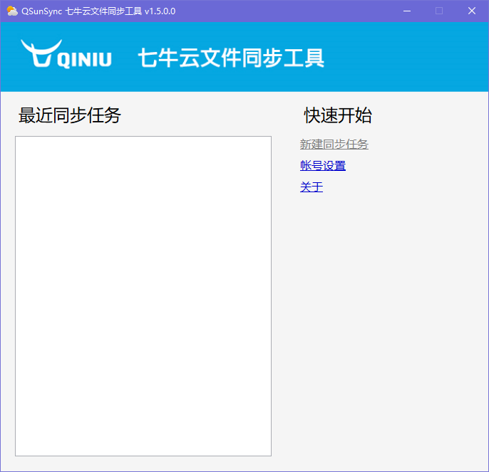

`界面1 初始界面`

初始状态下，由于尚未设置账号，因此“新建同步任务”处于不可用状态，关于“账号设置”请参考后续介绍。

####1.1 最近同步任务

保留最近同步的项目（参考后文介绍）。显示项目的同步时间、目标空间及本地同步目录。通过双击某条项目纪录，可以直接跳转至同步设置界面（界面 3），且所有配置与之前同步该项目时配置保持一致。若两次将同一个目录上传到同一个空间，只会保留最近的一条记录。

####1.2 快速开始

#####1.2.1 新建同步任务

点击此处将跳转至“同步设置界面”（界面 3）新建同步任务。若之前从未在“账号 设置界面”中配置过 AK／SK 信息，该选项将为灰色，点击不会跳转。

#####1.2.2 账号设置

点击此处将跳转至“账号设置界面”（界面 2），输入 AK/SK 登陆 QSunSync。一旦登录成功将记录 AK/SK，之后再次使用时，不需重新配置。

#####1.2.3 关于

点击此处跳转到网页介绍。

####1.3 关闭程序

点击界面上的“关闭”按钮，程序会隐藏至托盘，但不终止运行。如需彻底关闭，右键点击托盘图标，点击“退出”即可。

###2. 账号设置

####2.1 账号设置界面

初次使用 QSunSync 时需要在此页面输入 AK/SK 进行登陆。一旦登陆成功将记录 AK/SK， 之后再次使用时，无需重新配置。

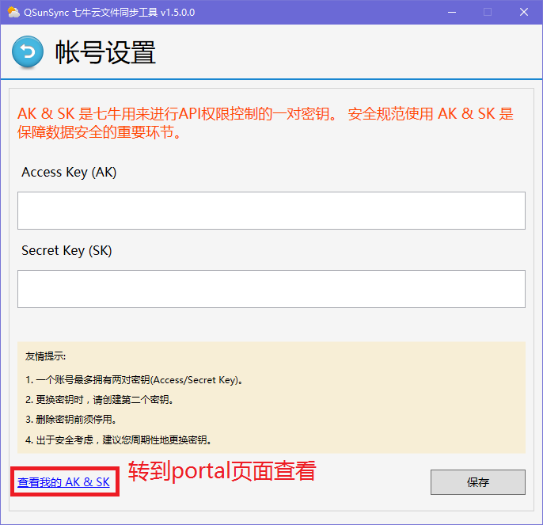

`界面2  账号设置界面`

####2.2 账号设置

点击账号设置界面“查看我的AK & SK”或者直接输入网址portal.qiniu.com进入portal页面。

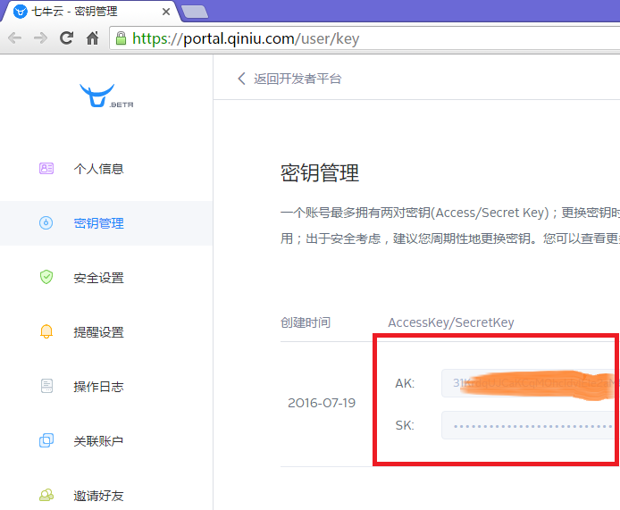

在“秘钥管理”界面可以找到AK和SK，其中SK默认隐藏，可以点击显示框中的“显示”按钮展现明文。

将对应的AK和SK填入账号设置的对应输入框中，点击“保存”即可。

###3. 同步设置界面 

设置好账户AK&SK之后，主界面“新建同步任务”已经变为可用状态。

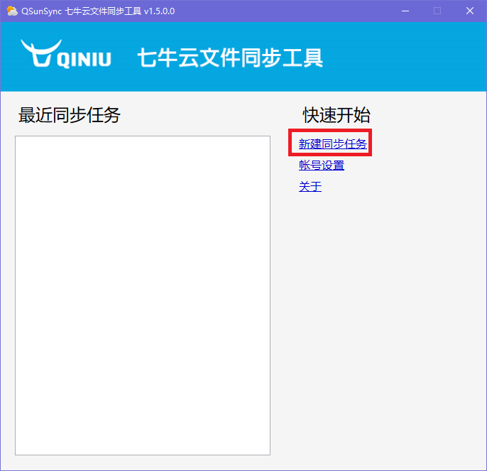

点击“新建同步任务”进入任务同步设置。

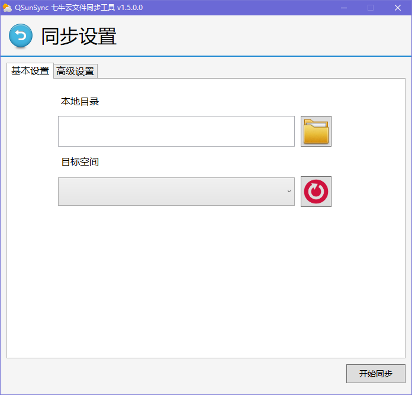

`界面3  同步设置界面`

####3.1基本设置

#####3.1.1 本地目录

选择需要同步到七牛的本地目录。

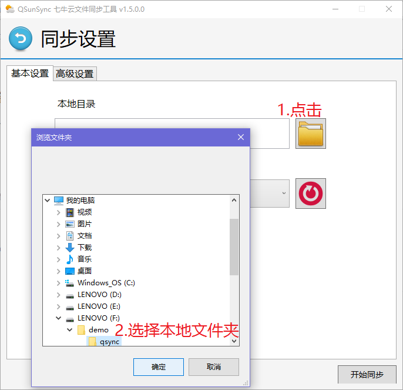

#####3.1.2 目标空间

将文件上传到七牛指定空间

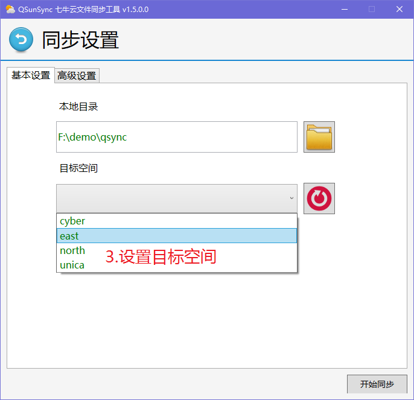

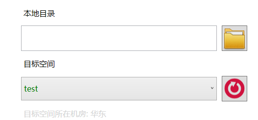

####3.2 高级设置

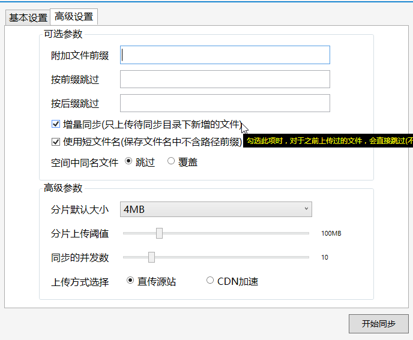

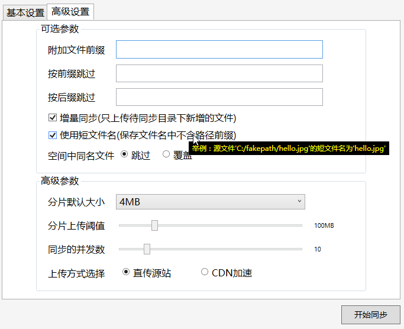

#####3.2.1 附加文件前缀

可使用前缀进行文件管理。

示例：如需要将两个文件夹 a、b 同步到同一七牛空间，其 中文件夹 a 内全为图片，有文件 1.jpg、2.jpg 等；文件夹 b 中全为视频，有文件 3.mp4、 4.mp4 等。为了方便管理，在文件夹 a 同步时，设置前缀为 img，则文件 1.jpg、2.jpg 在七 牛空间中的 key（文件名）分别为：img1.jpg 及 img2.jpg。文件夹 b 同步时，设置前缀为 video，则文件 3.mp4、4.mp4 在七牛空间中的 key 为：video3.mp4 及 video4.mp4。

#####3.2.2 忽略文件名相对路径

示例：假设有同步文件夹 sub1，其中 sub1 下有子文件夹 sub2，文件夹sub2下有文件夹sub3，如下图所示，其中sub3下有图片1.jpg。若勾选该选项，则此图片在七牛空间中的key为sub1/sub2/sub3/1.jpg,勾选之后的key为1.jpg。

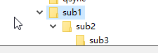

#####3.2.3 同名文件覆盖

文件上传到空间时，会通过对比 hash 确认是否空间中已有相同文件。若 hash 相等，则 不会上传新文件。若 hash 不相等，则会查看“空间中同名文件强制覆盖”选项，如该选项被勾选，则会上传新的文件，若此选项不被勾选，则会报错。

#####3.2.4 分片上传阈值

默认值为最大4MB。设置阈值后，若文件大小大于等于该值，则自动使用分片上传。小于该值则自动使用表单上传。

#####3.2.5 同步的并发数

可以允许多文件同时并发上传，并发数可选范围：1～60。

#####3.2.6 上传目的机房

程序会根据用户的Bucket(目标空间)自动列出合适的上传目的机房以供用户选择。

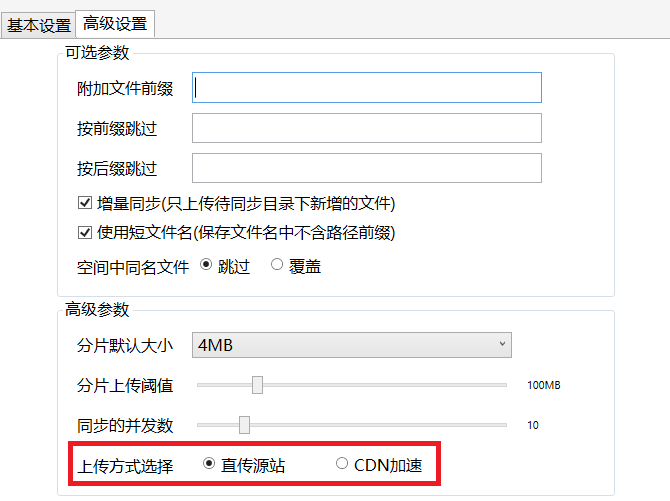

####3.3 开始同步

完成以上所有设置后，点击“开始同步按钮”开始同步。

###4. 同步信息

点击“开始同步”按钮后，如果一切正常，程序会跳转到“同步进度”页面。

####4.1 同步进行时

`界面4.1  同步进度界面`

#####4.1.1 多线程同步进度表

可得到每个线程的同步文件名、当前文件上传进度及速度。

#####4.1.2 同步信息汇总

可得到完成同步文件个数及同步完成百分比。

#####4.1.3 暂停

暂停后该按钮变为“继续”，点击“继续”按钮可继续此次同步任务。若在暂停时有文件尚未传完，该文件可在“继续”后断点续传。

#####4.1.4 结束

点击按钮跳此次同步结束，跳转至同步完成界面（界面 4.2）。此次任务及其配置将会保存至最近同步任务。若在结束时有文件尚未传完，该文件之后可断点续传。

####4.2 同步完成后

`界面4.2  同步完成界面`

#####4.2.1 同步信息总览

可得到同步时间及同步成功/失败等文件名及错误信息。
#####4.2.2 导出日志

可导出本次同步日志，包含同步成功及失败文件信息。

#####4.2.3 返回首页

跳转至初始界面（界面 1）。

###5. 历史记录

回到主页后，在“最近同步任务”列表中可以看到同步历史（按最近时间排列）。选择指定记录，右键菜单中有“删除任务”（删除历史记录）和“导出日志”功能。

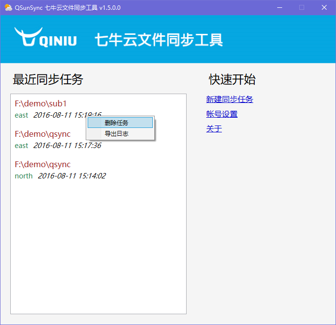

`界面5 主界面(历史记录)`

##意见&帮助

如果你有任何的意见，可以通过提 issue，我们来讨论。如果你需要帮助，可以联系我 （QQ: 2037014430），非技术勿扰。
